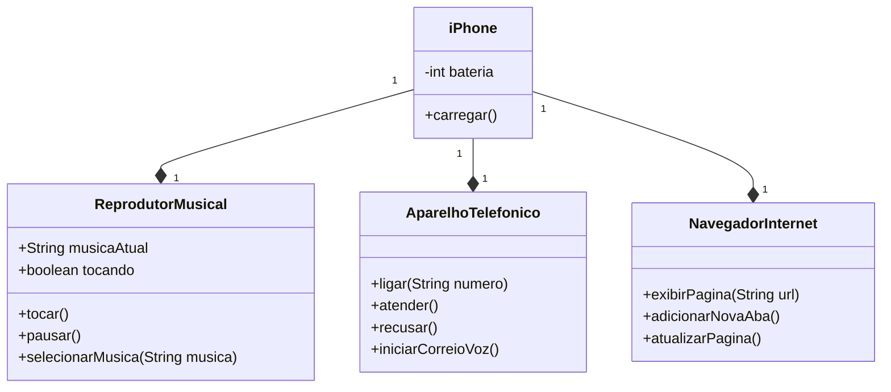

# Implementação de classes basicas em java a partir de um projeto UML 

```mermaid
classDiagram
    iPhone "1" --* "1"ReprodutorMusical
    iPhone "1" --* "1" AparelhoTelefonico
    iPhone "1" --* "1" NavegadorInternet
    iPhone : -int bateria
    iPhone: +carregar()

    class ReprodutorMusical{
      +String musicaAtual
      +boolean tocando
      +tocar()
      +pausar()
      +selecionarMusica(String musica)
    }
    class AparelhoTelefonico{
     
      +ligar(String numero)
      +atender()
      +recusar()
      +iniciarCorreioVoz()
    }
    class NavegadorInternet{
 
      +exibirPagina(String url)
      +adicionarNovaAba()
      +atualizarPagina()
    }
```